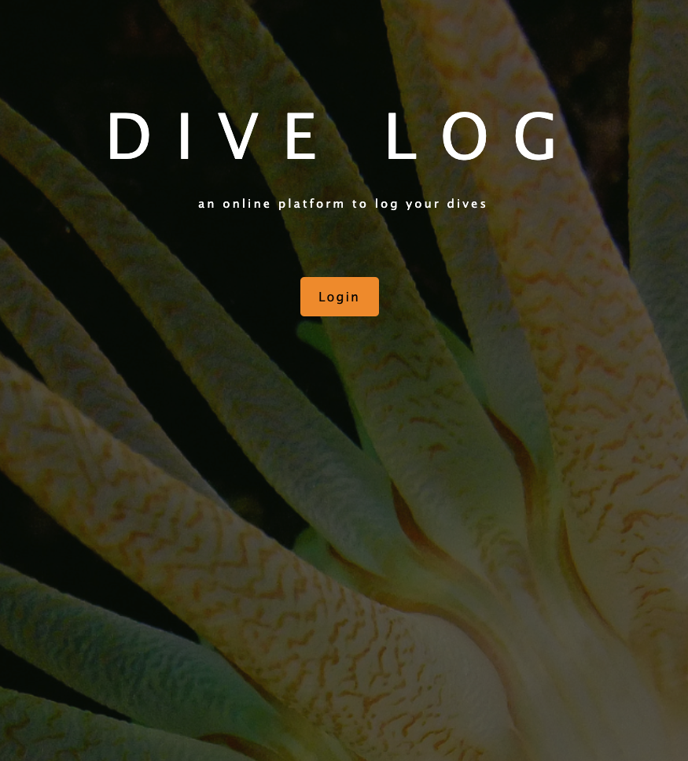
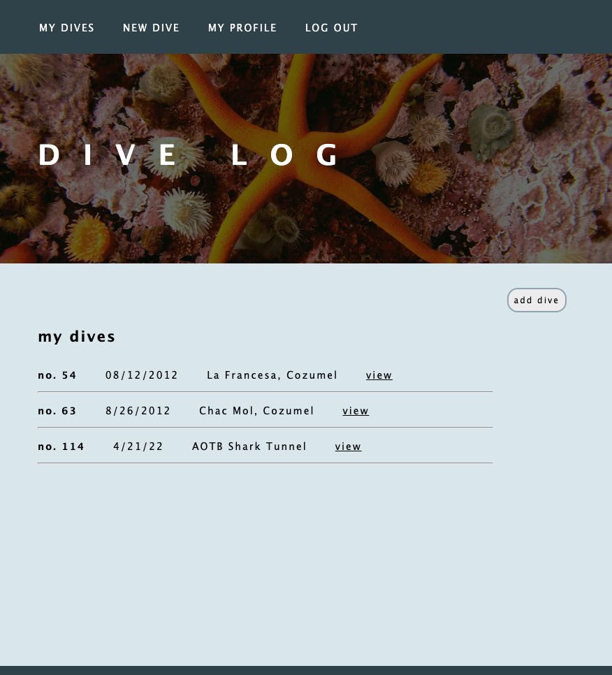
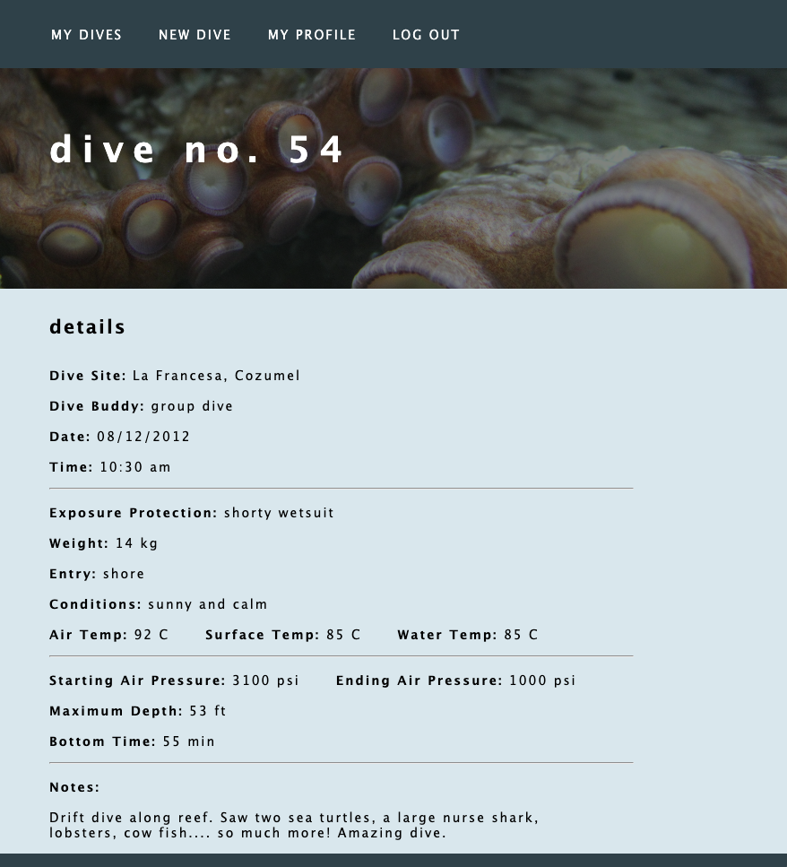
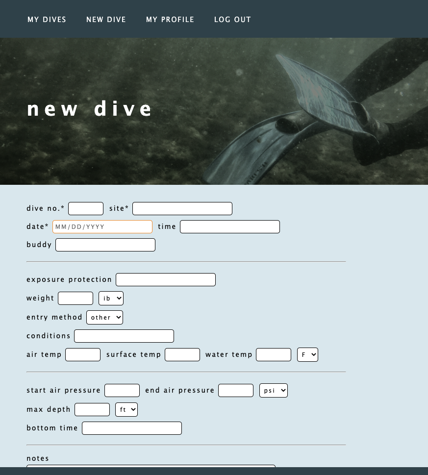
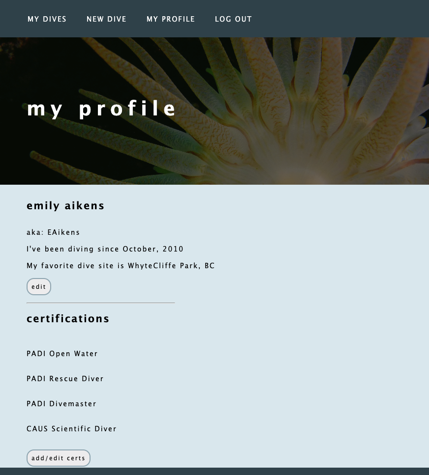

# Project 2: Dive Log

## Description:
A full-stack app designed for divers to log, save, and access their dives online. 

## Technical Requirements
1. Have at least two data entities (data resources) in addition to the User Model
2. Use OAUth authentication
3. Implement basic authorization that restricts access to features that need a logged in user in order to work
4. Have a full-CRUD data operations somewhere within the app's features.
5. Have a consistent and polished user interface
6. Be deployed online (Heroku)

## Technologies Used
 

 

 

 

 

## Getting Started

* [Link to app](https://enigmatic-basin-31771.herokuapp.com/)

* Instructions: login with a google account to get started

## App Screenshots

Login page

 My Dive Log 

 

 My Dives 

 

 New Dive 

 

 Profile 

## Project Hurdles
* The largest hurdle I had, by far, was having to start my project over two days before it was due. My first plan was to create a flashcard app, but after creating all of the CRUD functionality I was left with the question of how to implement the "previous card", "next card", and "flip card" functions. While it was possible to create routes for this functionality to work, I quickly realized that the combination of technologies required for this project were not the most efficient tools for a flash-card app. This project was designed to give us a thorough understanding of the required technologies - not just _how_ to use them, but also _when_ to use them. I chose to honor the purpose of the project by starting a new app that would be better suited to the technology - thus, the dive log app was born. Despite doubling my work load, I am glad of my choice because I now feel extremeley confident in my ability to work with the involved technologies. 

* A hurdle I faced during my flash-cards edition of this project was understanding data flow. I am a visual learner so, predictably, the thing that helped me the most was drawing it out. With the help of a whiteboard and a rainbow of markers, I broke down the components of a URL and mapped out every pathway. Finally, I could see how the server, routes, views, models, and controllers all fit together. Once I figured out where the pieces interacted, I was able to create pathways quickly and the process actually became quite fun. 

* Dates. I found it incredibly frustrating to work with the data type: Date. It caused problems in almost every CRUD operation. In the end, I changed the date input to a string type and left it at that. When I have a bit more time, I would like to revisit how Date-type data works within Express, MongoDB and Mongoose. 

## Planning Charts

CRUD Flow Chart

ERD

Page Layout

## Planning Links

* [Planning/Pseudocode: Google Doc](https://docs.google.com/document/d/1AZvyxvdnltxkjQmsthisayq21--fnwLX5ruJO0g98dk/edit?usp=sharing)

* [Data Flow: Google Sheet](https://docs.google.com/spreadsheets/d/1FWgW4MXwyAINuuvfisloNnvXlRBv9NIRCU9RaLkd3xs/edit?usp=sharing)

* [Progress Tracking/AAUs: Trello Board](https://trello.com/b/EORctDLm/dive-log)

* [Wireframe Pages: Whimsical](https://whimsical.com/project-2-flash-cards-V4m9vgEdUeR6wBrFP1uoEr)

* [ERD: Lucidchart](https://lucid.app/lucidchart/c21ddceb-c136-4b10-885b-a41790babade/edit?page=0_0&invitationId=inv_95a520de-bfd8-4610-a430-0cdf9dd83f26#)

## IceBox

* Style for a responsive design
* Add more fields to the dive log
* Create another schema to hold dive buddies. This would allow user to select a buddy from a dropdown menu which would save some typing time if the user is always diving with the same few people. The same would be true for dive sites.
* Use a third-party-API, allow users to connect with one-another and have the option to view each others dive logs. 

### Image Credit

Andrew McCurdy: "My Dives", "Login Page", "My Profile"
Emily Aikens: Everything else
